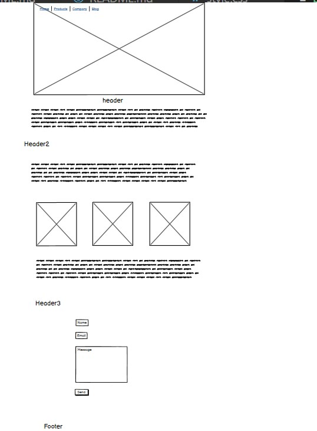
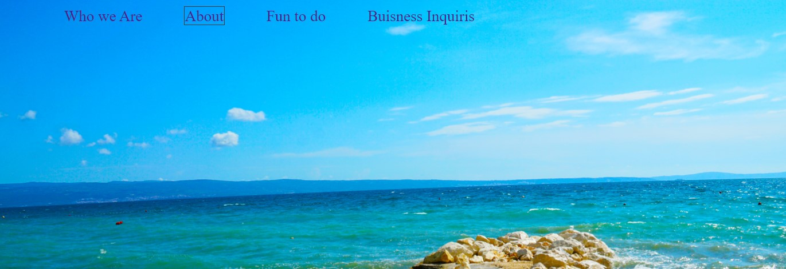
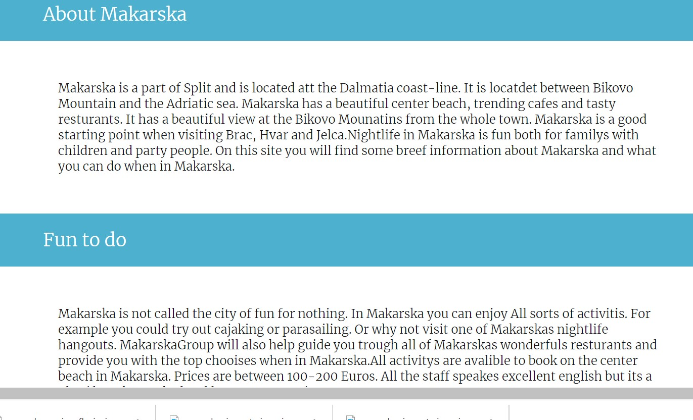
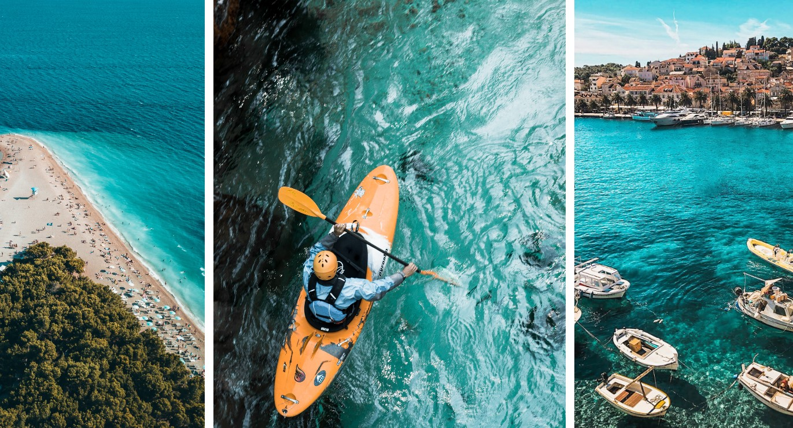
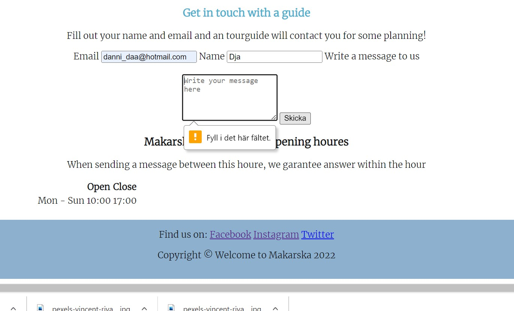
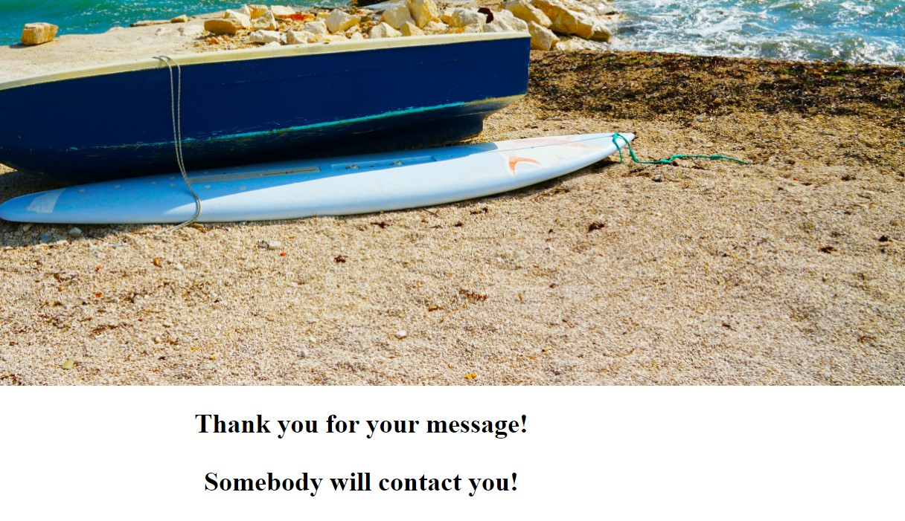
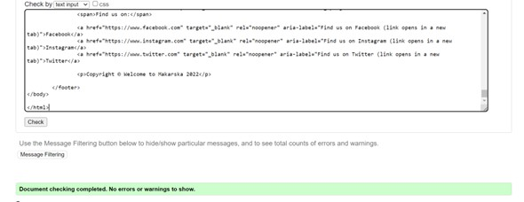
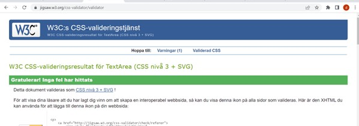
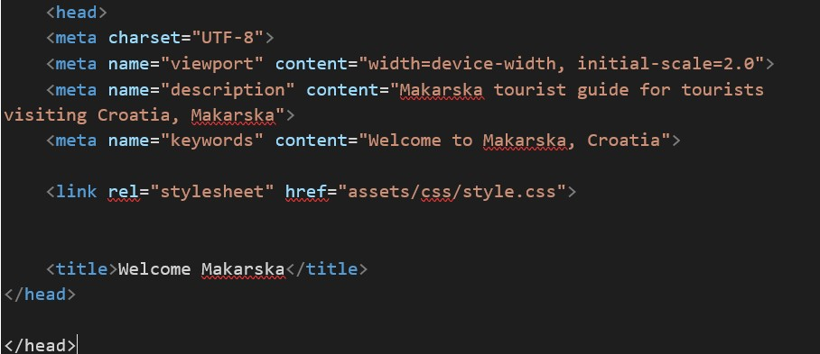

# Welcome to makarska

Have you ever dreamt of travelling to the beautiful Country Croatia? With its beautiful beaches and amazing natur. One of the most populare citys of the mediterrian country is Makarska. Its a beautiful place near to both Jelca and Brac and not to speak about how amazing the beaches are with amazing blue water and fun activitis. We at MakarskaGroup will help you guide trough all of Makarskas wonderful places and also provide a plan with activitis.

## User Stories

User can choose to click on the menu to navigat troughout the page or they can scroll. Menu contains three hyperlinks connected to different sections of the page. After the menu title a images is placed with a section "about us" below. When user scroll down the page one can read some facts about Maskarska. The titles are all placed in the same class to keep the webdesign pretty and clean. Following the About section is the fun activitis-section,with information of what MakarskaGroup can guide you trough in activitis. The user also have the option to get in contact with us to book one of our touristeguides based in Makarska. User can book trough a form. Users are required to fill in both name, email and a message with booking information. When the message is sent user will get directed to a confirmation message. User can guide back to the mainpage trough the menu section.

 

### Features
* Navigation link bar connected to different section of the page:
* The different sections have all styled headers with blue backgrounds and white text to match the team of the page. Except for the first header "Welcome to MakarskaGroup". 
* The whole page contains four pictures of Makarska. All of them are with blue ocean visible to fit the styling of the page. 
* A form to fill in with required sections down on the page with a table of "Open Hours". Both have matching text colour.
* When redirected to the confirmation message, user can redirect back to the main page trough the menubar
* The whole page is responsiv. Some sections are hardcoded with pixels to stay in place even when  the screen gets smaller but also with % to match the screensize
* The footer contains links to facebook and instagram and twitter. All of whom redirect to mentioned mainpages

### Future Features

* Add a section with a gallery of touristphotos
* Add a section where tourist can give feedback on their experience
 

## Wireframe

I choose to use one wirefram for this project, showing how I planned my new webdesign wich I later filled with content that fitted the purpose.

## Technology

* Github to store my repostories
* Gitpod used to work with my HTML and CSS codes on
* W3C Validator to validat my HTML codes
* CSS Validator to validate my CSS codes
* HTML for codes to build the webpage
* CSS codes for styling
 

## Testing

I have tested my wbpage by navigating troughout the website with this steps.
* I clicked on the different menu section to look for any broken links. No btroken links found.

On This first picture I am testing the different links both on the mainpage but also on the confirmationpage.
 

When I clicked on the "About" link in the menu it directed me to the "About" section. The header has a blue colour to match the team of the page.
 

The page contains beautiful pictures of Makarska. Pixels are good and the images dosent get blurry on any screentest.
 

* I tried to sen a empty form down in the Buisness Inquiris section. It did not work. Then I tried to fill out the form and send. That worked fine. I than tried every link in the "Confirmation message" and every link worked. 

Every link on the confirmationpage works fine.

* I have tested my page trough the HTML Validator. https://validator.w3.org/ I copy pasted the whole codepage. No errors detected.

* I hav tested my page trough the CSS validator. https://jigsaw.w3.org/css-validator/ I copy and pasted the whole codepage. No errors found.

### Bugs

Two bug where detected and fixed during the validation of the project

 
 * A dubbel closing "head" element. I did not notice the error straight away but I did notice that my page was not as it should be. So I scanned the codes and detected the problem almost right away.

 * Another Bug was detected after submission. A broken link in the menu section. The reason for that was that I changed the ID name but forgott to change it in the used menu link.
 

### Unfixed bugs
No unfixed bugs

### Screen testing
Tested on screens:
  
  * Webbrowser
  * Iphone SE
  * Ipad Mini

## Deployment

* Deployment on github: I went to mo reposistoris and clicked on my project. Then went to settings--pages and than choose "main" in the scroll bar in the branch section. Then clicked save.

* On gitpod:First I choose "terminal" from the bar to the top left. There I chose "New terminal" to have one more terminal to work with. Then I wrote "python3 -m http.server" in the first terminal and enter.

## Credits

### Text
  * The footer code was taken from the Love Running project
  * I used some of W3Schools codes to line up the pictures. I used their flex example. The codes bleong to the Pictures class and Croatiaimage class in the CSS file. Not the responsive ones thou.  

### Media
  
   The free photos where taken from pexels  

   

