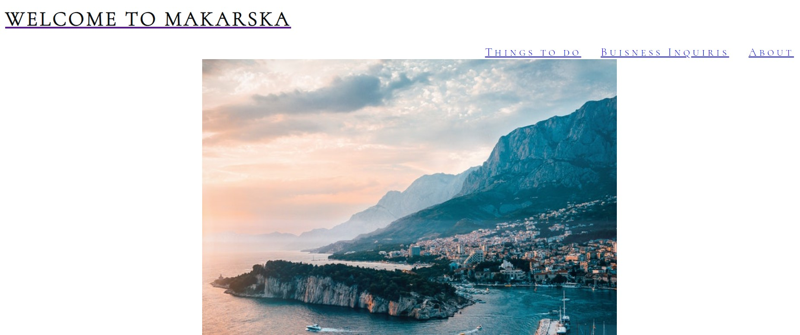
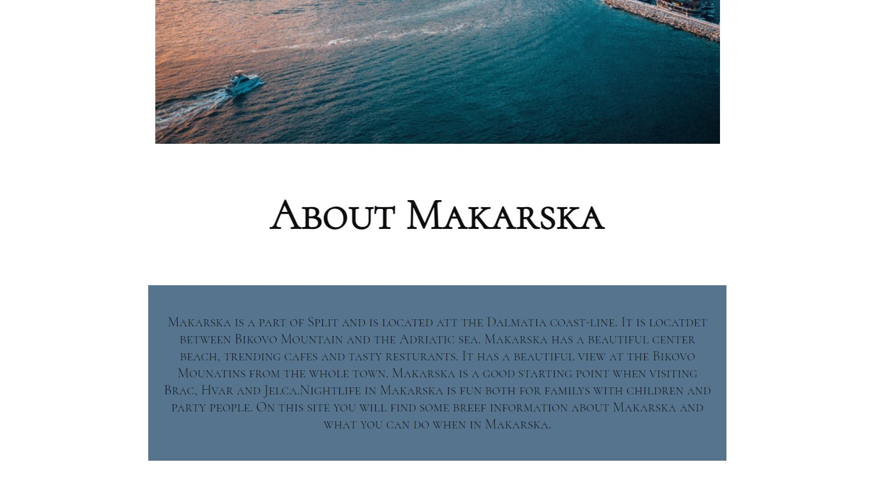
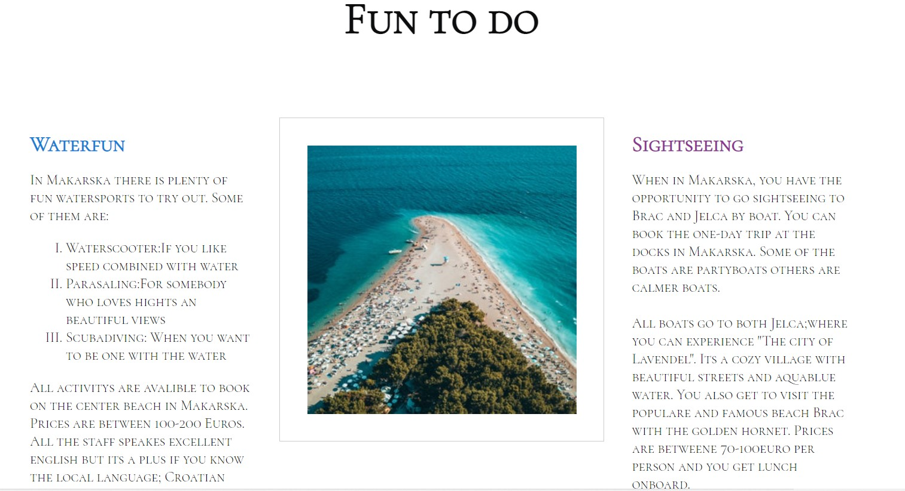
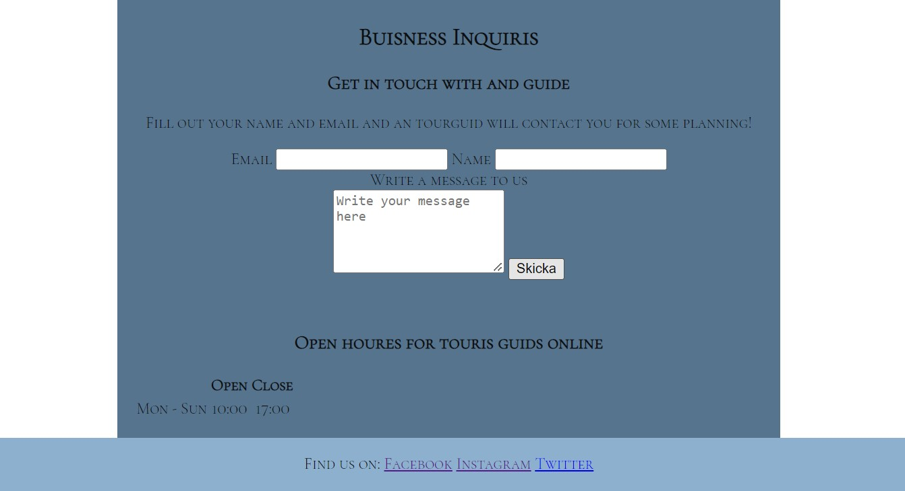
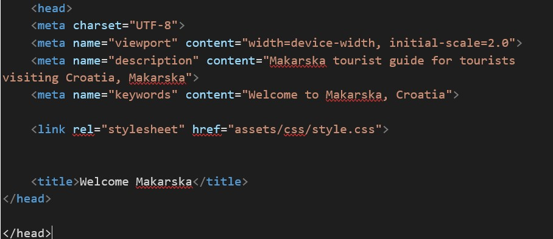

<h1>Project 1: Readme</h1>
<h2>Purpose</h2>

Purpose of the project is for users of the website is to have a collected site with information about Makarska. The user can read a little about Makarska and also click in the menu to read about "fun to do" in Makarska and also contact an touris guide via the website.

<h2 id="features">Features</h2>
<ul>
  <li>The user has an menu section(as you can see on the print abowe) where he/she can click on the links and the page will automaticlly scroll to:</li>
   <li>Fun to do: A page with suggestions to what you can do when in Makarska.</li>
   <li>About: A little facts about Makarska.</li>
   <li>Buisness Inquires: A form where the user can get in touch with a touris guide</li>

</ul>

in the Menu section the user can find navigation links to the "About", "Fun to do" and "Buisness inquiris" sections.

<h3>About</h3> 
 <ul>
  <li>In this section users can read a little about Makarska and why it is worth visiting this town, where it is located and some tourist attractions.</li>
  <li>The section is placed in a box to make the text stand out a little from the background.</li>
</ul>

<h3>Fun to do</h3>
 <ul>
  <li>This section describes for the users what you can do in Makarska.</li>
  <li>The users can read about waterfun and sightseeing.</li>
  <li>The two topics are divided and in center you can se a picture of Brac</li>
 </ul>

 

<h3> Buisness Inquris</h3>
 <ul>
  <li>A section with an form where user can fill out with name, email(requried) and a message and a tourisguide will get in touch</li>
 </ul>
 
 

<h2>Future features</h2>
 <ul>
  <li>implement a gallery with touris pictures</li>
</ul>

<h2>Tecnology</h2>
<h3>Testing</h3>
 <h4>Validator testing</h4>
 
The website was tested in different programes and came back without errors. Programs I used.

  <ul>
   <li>W3C Validatore for HTML</li>
   <li>(Jigsaw) Validatore for CSS</li>
  </ul> 

 <h4>Bugs</h4>
  <li> One bugs where detected and fixed during the validation of the project</li>

 
 
A dubbel closing "head" element. Was fixed by removing it

 
  <h4>Unfixed bugs</h4>
   <li>No unfixed bugs</li>

  <h3>Userstorys</h3>
  <ul>
  <li>Github:T save my workspace on</li>
  <li>Gitpod:My workspace</li>
  <li>CSS:For styling</li>
  <li>HTML:For content</li>
  </ul>

<h2>Credits</h2>
 <h3>Text</h3>
   <ul>
    <li>The codes to the menu where taken from the "Loverunning project"</li>
    <li>The footer codes where taken from the "Loverunning Project"</li>
    </ul>   
 <h3>Media</h3>
  <ul>
   <li>The photos where taken from pexels</li>   

   <h2>Deployment</h2>

   <h3>Github</h3>
   <ul>
   <li>Went to my home page, choose my project: clicked on it</li>
   <li>In the menu abow you can se a 'setting' button to the left. Clicked on it.</li>
   <li>On the new page I clicked on the scroller menu and chose 'main'</li>
   </ul>

