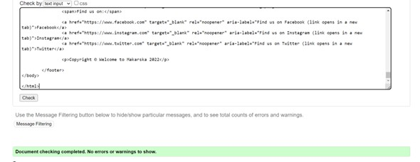

# Welcome to makarska

Have you ever dreamt of travelling to the beautiful Country Croatia? With its beautiful beaches and amazing natur. One of the most populare citys of the mediterrian country is Makarska. Its a beautiful place near to both Jelca and Brac and not to speak about how amazing the beaches are with amazing blue water and fun activitis. I have created a touristguid to guidline you trough activitis in and near Makarska. A perfect "first-visit-guide"

## User Storys

User can choose to click on the menu to navigat troughout the page or they can scroll. When user scroll down the page one can read some facts about Maskarska. Following, a section with fun activitis in makarska, both playfull activitis and sightseeing. The user also have the option to get in contact with us to book one of our touristeguides based in Makarska. User books trough a form. Users are required to fill in both name, email and a message with questions. When the message is sent user will get a confirmation message. One can therafter click back to mainpage trough the menusection.

in the Menu section the user can find navigation links to the "About", "Fun to do" and "Buisness inquiris" sections.

<h3>2.1 About</h3> 
 <ul>
  <li>In this section users can read a little about Makarska and why it is worth visiting this town, where it is located and some tourist attractions.</li>
  <li>The section is placed in a box to make the text stand out a little from the background.</li>
</ul>

<h3>2.2 Fun to do</h3>
 <ul>
  <li>This section describes for the users what you can do in Makarska.</li>
  <li>The users can read about waterfun and sightseeing.</li>
  <li>The two topics are divided and in center you can se a picture of Brac</li>
 </ul>

 

<h3>2.3  Buisness Inquiries</h3>
 <ul>
  <li>A section with an form where user can fill out with name, email(requried) and a message and a tourisguide will get in touch</li>
 </ul>
 
 

<h2>3. Future features</h2>
 <ul>
  <li>implement a gallery with touris pictures</li>
</ul>

<h2>4. Tecnology</h2>

<h3>4.1Testing</h3>

<h4>4.1.1 Validator testing</h4>

  
The website was tested in different programes and came back without errors. Programs I used.

   <ul>
    <li>W3C Validatore for HTML</li>

  

  <li>(Jigsaw) Validatore for CSS</li>

  
   </ul> 

 <h4>4.1.2 Bugs</h4>

  <li> One bugs where detected and fixed during the validation of the project</li>

 
 
A dubbel closing "head" element. Was fixed by removing it

  <h4>4.1.3 Unfixed bugs</h4>
   <li>No unfixed bugs</li>

   <h4>4.1.4 Screen testing</h4>
   
Tested on screens:

   <ul>
    <li>Iphone SE
    </li>
    <li>Chrome
    </li>
    <li>Ipad mini</li>
    </ul>
 
  <h3>4.2 Userstorys</h3>

  <ul>
  <li>Github:T save my workspace on</li>
  <li>Gitpod:My workspace</li>
  <li>CSS:For styling</li>
  <li>HTML:For content</li>
  </ul>

<h2>5.Credits</h2>

 <h3>5.1 Text</h3>
   <ul>
    <li>The codes to the menu where taken from the "Loverunning project"</li>
    <li>The footer codes where taken from the "Loverunning Project"</li>
    </ul>   

 <h3>5.2 Media</h3>
  <ul>
   <li>The photos where taken from pexels</li>   

   <h2>6 Deployment</h2>

   <h3>6.1 Github</h3>
   <ul>
   <li>Went to my home page, choose my project: clicked on it</li>
   <li>In the menu abow you can se a 'setting' button to the left. Clicked on it.</li>
   <li>On the new page I clicked on the scroller menu and chose 'main'</li>
   </ul>

